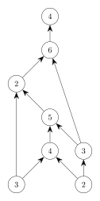

```@meta
EditURL = "examples/scheduling.jl"
```

# PERT Networks

A PERT network encodes a project as a vertex-weighted graph ``G = (V, E, w)``.

- **vertices** ``i \in V`` represent tasks.
- **edges** ``(i, j) \in E`` represent precedence constraints: task ``i`` must finish before task ``j`` can start.
- **vertex weights** ``w_i \in [0, \infty]`` represent durations: task ``i`` takes ``w_i`` days to complete.

The figure below shows a PERT network with eight tasks and ten precedence constraints.



We can represent the network as a matrix ``A: V \times V \to [-\infty, \infty]``, where
```math
A_{ij} = \begin{cases}
    w_i     &\text{if } (i, j) \in    E \\
    -\infty &\text{if } (i, j) \notin E
\end{cases}
```
for all pairs of tasks ``(i, j) \in V \times V``.

````@example scheduling
using SemiringFactorizations, SparseArrays

# max-plus semiring
const MP = MaxPlus{Float64}

# durations
w = MP[3, 2, 4, 3, 5, 2, 6, 4]

# precedence constraints
#    1  1  2  2  3  4  4  5  6  7
#    ↓  ↓  ↓  ↓  ↓  ↓  ↓  ↓  ↓  ↓
#    3  6  3  4  5  7  5  6  7  8
I = [1, 1, 2, 2, 3, 4, 4, 5, 6, 7]
J = [3, 6, 3, 4, 5, 7, 5, 6, 7, 8]

A = sparse(I, J, w[I], 8, 8)
````

The Kleene star of ``A`` is a matrix ``A^*: V \times V \to [-\infty, \infty]``
whose entry
```math
A^*_{ij} \in [-\infty, \infty]
```
is equal to the shortest possible interval between the start of ``i`` and the start of ``j``. In
particular, if ``j`` can precede ``i``, then ``A^*_{ij} = -\infty``.
We can compute ``A^*`` explicitly using the function `star`.

````@example scheduling
star(A)
````

Alternatively, we can compute a factorized representation of ``A^*`` using the function `slu`.
This approach is generally faster than the previous one.

````@example scheduling
K = slu(A)
````

## Scheduling

We will also distinguish two sets of tasks.
  - **start** tasks: ``S \subseteq V``
  - **final** tasks: ``F \subseteq V``
Our goal is to complete the tasks in ``F``, starting with the tasks in ``S``.

````@example scheduling
S = [1, 2]; F = [8];
nothing #hide
````

We can represent ``S`` as a vector ``s: V \to [-\infty, \infty]``, where
```math
s_i = \begin{cases}
    0       &\text{if } i \in    S \\
    -\infty &\text{if } i \notin S
\end{cases}
```

````@example scheduling
s = zeros(MP, 8); s[S] .= 0
s
````

We can represent ``F`` as a vector ``f: V \to [-\infty, \infty]``, where
```math
f_i = \begin{cases}
    w_i     &\text{if } i \in    F \\
    -\infty &\text{if } i \notin F
\end{cases}
```

````@example scheduling
f = zeros(MP, 8); f[F] .= w[F]
f
````

## Earliest Start and Finish Times

For all tasks ``i \in V``, the *earliest start time*
```math
s^e_i \in [0, \infty]
```
is the earliest time that ``i`` can begin.

````@example scheduling
se = transpose(transpose(s) * K)
````

The *earliest finish time*
```math
f^e_i \in [0, \infty]
```
is the earliest time that ``i`` can be completed.

````@example scheduling
fe = se .* w
````

## Makespan

The *makespan* is the earliest
that the project can be completed. If the project takes
longer than this time, then it is *behind schedule*.

````@example scheduling
c = transpose(se) * f
````

## Latest Start and Finish Times

For all tasks ``i \in V``, the *latest start time*
```math
    s^l_i \in [0, \infty]
```
is the latest time that ``i`` can begin without
the project falling behind schedule.

````@example scheduling
sl = transpose(c / (K * f))
````

The *latest finish time*
```math
    f^l_i \in [0, \infty]
```
is the latest time that ``i`` can finish without
the project falling behind schedule.

````@example scheduling
fl = sl .* w
````

## Slack and Critical Tasks

For all tasks ``i \in V``, the difference
```math
    s^l_i - s^e_i \in [0, \infty]
```
is called the *slack* at ``i``. It encodes how long
``i`` can be delayed before the project falls behind
schedule.

````@example scheduling
slack = sl ./ se
````

A task ``i \in V`` is called *critical* if its slack is zero.
Critical tasks cannot be delayed without delaying the whole
project.

````@example scheduling
critical = findall(isone, slack)
````

---

*This page was generated using [Literate.jl](https://github.com/fredrikekre/Literate.jl).*

